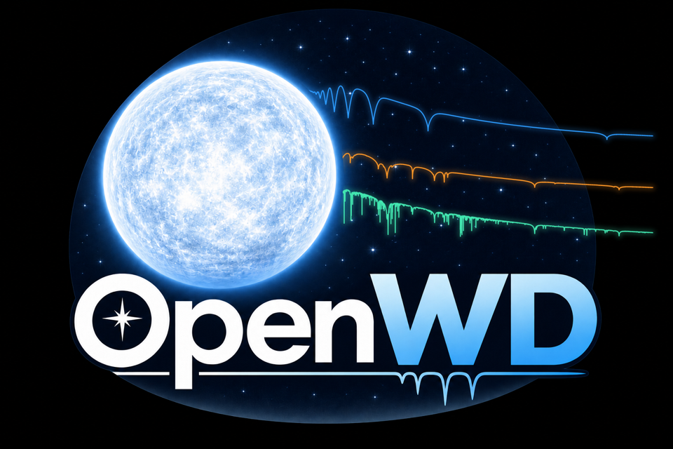
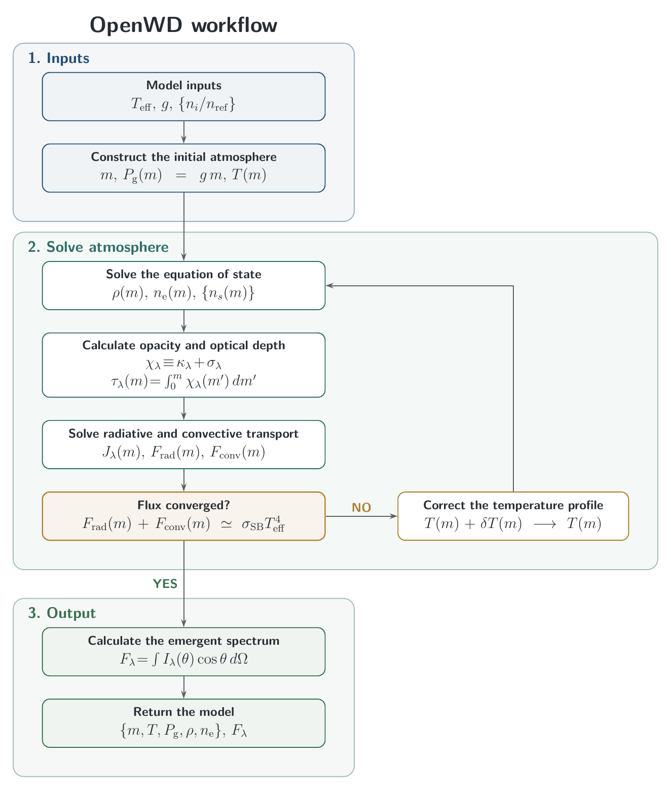

<p align="center">
  
</p>

# OpenWD

OpenWD calculates white-dwarf atmospheres and their emergent spectra from
temperature, surface gravity, and composition. It solves the atmospheric
structure and radiative transfer from scratch, rather than interpolating a
precomputed spectral grid.

The code supports plane-parallel, LTE models of:

- **DA:** hydrogen atmospheres.
- **DAZ:** hydrogen-dominated atmospheres polluted by metals.
- **DB:** helium atmospheres.
- **DAB/DBA:** homogeneous hydrogen–helium mixtures.
- **DZ/DBZ:** helium-dominated atmospheres polluted by metals.

## Get started

Clone the repository and install it with Python 3.9 or newer:

```bash
git clone https://github.com/kareemelbadry/OpenWD.git
cd OpenWD
python -m pip install -e .
```

Generate a hydrogen-atmosphere spectrum:

```python
from wd_spectra import DAConfig, run_model

run = run_model(
    DAConfig(effective_temperature=12_000, logg=8.0, quality="standard"),
    "results/my-first-da",  # use a new directory for each run
)

wavelength = run.spectrum.wavelength_angstrom
surface_flux = run.spectrum.surface_flux_lambda
print("Numerical convergence verified:", run.convergence_verified)
```

The calculation reports progress and saves its spectrum, diagnostics, and
input parameters. Wavelengths are vacuum Angstroms; flux is the emergent
surface `F_lambda` in erg s⁻¹ cm⁻² Å⁻¹. No previous atmosphere is needed.

For an editable, plotting walkthrough, open the
[example notebook](examples/generate_spectrum.ipynb).
The [getting-started guide](docs/getting-started.md) covers installation,
changing composition, output files, and cool-model data requirements.

## How it works

OpenWD couples hydrostatic structure, LTE equations of state, opacity,
radiative transfer, and ML2 convection. Hydrogen and helium line profiles,
continuum absorption, and metal opacity are included as appropriate to the
composition. `run_model` selects the implemented physics using composition
and local material diagnostics before solving; it does not change physics
in response to a failed calculation.

An optional C extension accelerates the expensive transfer and opacity
kernels. See the [model guides](docs/models/README.md) for the physical
ingredients and the [performance guide](docs/development/performance.md)
for threading and benchmarks.



## Caveats and limitations

OpenWD is pre-alpha research software. Convergence and physical applicability
must be checked for each result. Exploratory spectra remain available with a
warning; pass `require_convergence=True` to require numerical qualification.
The [limitations guide](docs/limitations.md) explains what that qualification
means, known accuracy limits, and which temperatures and compositions have
been tested.

## Documentation and development

Start at the [documentation home](docs/README.md). User instructions are
separate from the [development and testing guide](docs/development/README.md)
and the [historical research notes](docs/development/history/README.md).

To run the ordinary tests:

```bash
python -m pip install -e '.[test]'
python -m pytest
```

## Data and license

Data for the established presets are bundled. Molecular cool-model workflows
require additional public tables, described in the
[data instructions](research/cool_models/README.md#additional-molecular-dab-data).

OpenWD source is BSD-3-Clause licensed. Scientific tables retain their own
licenses and attribution; see [third-party notices](THIRD_PARTY_NOTICES.md).
