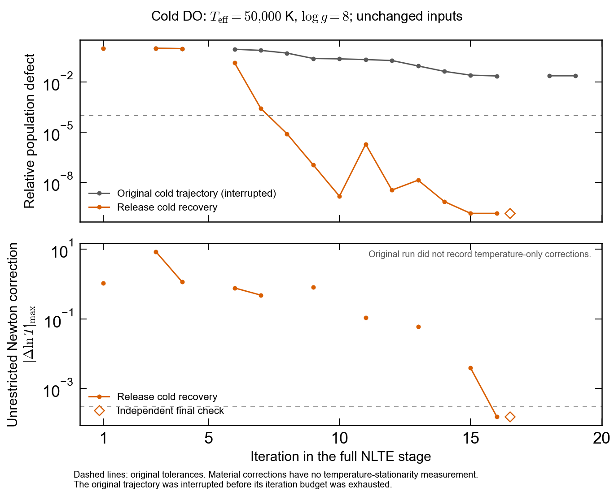
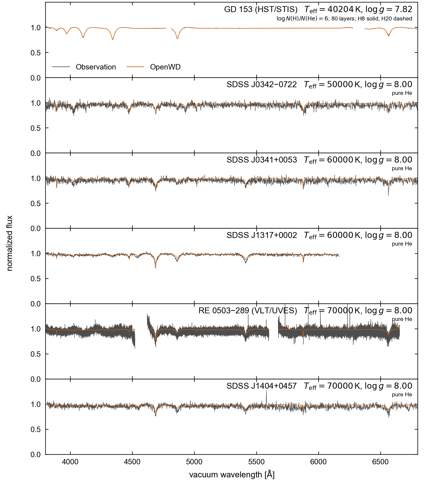

# DO/DAO release integration (2026-09-20)

OpenWD 0.1.4 adds `DOConfig`, `DAOConfig`, `compute_do`, `compute_dao` and
`run_model` dispatch using the central trust-region Newton solver. See the
[current user guide](../../models/DO-DAO.md) for data setup, numerical choices,
fixed-parameter runtime measurements and restricted-physics limitations.

## Convergence repair

Cold DO50 stalled because population equilibrium is curved and cached Newton
responses can point uphill after material changes. Population restoration
alone left a large temperature correction at shallow outer thermal roots.
The release enables bounded population restoration after two rejected full-NLTE
Newton directions; surface thermal roots are refined using full transfer and
neighboring thermal equations. Activated recovery refreshes a stale tangent.
The common driver retains acceptance, budgets and independent final checks.
Trial nonphysical population errors are recoverable; unrelated errors remain
fatal. Signed absorption is handled in emissivity form without clipping.

All seven prescribed public configurations completed from scratch. The
[machine-readable evidence](do-dao-cold-evidence.json) retains actual final
measurements, original thresholds, configurations, cold provenance and source
hashes. The runs span revisions: DO50 used the installed fresh-tangent
wheel; H20 loaded the preceding integration but never activated
recovery. Other model results retain their earlier source revisions. This is
not seven reruns of an identical final binary. No prior atmosphere, populations
or Jacobian initialized any counted invocation. Internal LTE/Planck-to-NLTE
initialization belongs to the same cold calculation.

The original trajectory was interrupted before exhausting its budget; it is
not described as a budget-exhaustion failure. Missing temperature measurements
on bounded/material steps cannot establish temperature stationarity.

## Performance and observed profiles

Frozen transfer-response reuse reduced a 40-layer Jacobian benchmark from
464.15 to 167.37 seconds (2.77x), with peak RSS 7.16 to 7.32 GB. Residuals were
bit-identical; maximum Jacobian-entry difference was 1.16e-13. This is a
Jacobian timing, not a controlled end-to-end model speedup.

[Vector overview](../../assets/do-dao-cold-observed.pdf) and
[all observed model variants](../../assets/do-dao-cold-variants.pdf) use only
qualified public cold models. Temperatures, gravities, compositions and saved
comparison velocities were not fitted. The synthetic DAO60 control has no
matching observed target and is absent from these plots.

DO50 passes the legacy comparison (chi-square ratio 0.982025). Both DO70
comparisons pass. J034101 at DO60 fails at 1.004217; J131724 passes at 0.978099.
GD153 production H8/H20 H-alpha normalized RMS values are 0.004937/0.005138,
versus 0.002644 for TMAP. The release remains experimental; cold convergence
is distinct from accuracy against observations and complete physical validation.

## Validation

Before release packaging, the integrated source passed 1,293 fast tests and
92 tests from an isolated installed wheel. The public cold evidence above
includes final independent temperature, flux, cell energy, source closure and
boundary checks plus population convergence. Source revision and external data
identities are retained; raw external collision files and observation caches
are not redistributed. The final publication checks are recorded below.

The initially published 0.1.4 wheel's 129 Python files were compared with the cold-qualified
wheel. Only the package version string and trailing whitespace in an
observation helper differ; all scientific Python sources match byte-for-byte.
All 1,466 bundled data files also match byte-for-byte.
DO/DAO request fingerprints carry their own
`restricted-h-he-joint-newton-v7-emissivity` physics identity and hashes of
collision and profile data. Existing model-family physics identities remain
unchanged because their declared equations and data were not changed.

The initially published 0.1.4 wheel also passed all 92 installed-package tests in 92.63
seconds, with imports asserted to originate outside the source checkout.
Its macOS ARM64/Python 3.9 wheel SHA256 is
`47150abf5d23bdf0ac2f67b23dc17f4e679d3a974b60c1b0f5ff4b029b07512f`.

## Initial publication checks

The isolated 0.1.4 candidate passed the full protected suite on Python 3.9:
1,301 fast/component tests (six optional-input skips), all 13 fixed-spectrum
controls and all 17 existing-family cold controls. The runner verified that
numerical inputs remained unchanged throughout. Every protected atmosphere
started fresh; no checkpoint or relaxed physical threshold was used. The
cold controls include DA, DB, DAB, dense/molecular helium mixtures, DAZ and
DQ's independent 218,520-point spectrum check. The separate seven-case DO/DAO
evidence and its per-revision limits are recorded above.

The staged scientific source, tests and package configuration were checked
against the isolated candidate before publication. Unrelated local DQ research
and cool-workflow edits were excluded. The cold-report validator also passed
its 12 regression tests, and all local links in the changed documentation
resolved.

Full-suite numerical/runtime identity: `441a7a611477eb1d128913a56d508b74a6cf76ae4a228ad9a36bcf190832cc6f`.
Retained full report SHA256: `d4ea466502c6994100374b3ffd4aa1b8b75f51731953bec3bfc72bb81af31975`.

## Transfer arithmetic correction found by GitHub CI

The first GitHub run exposed cancellation on the coarse three-/four-layer
unit-test grids on both Python 3.9 and 3.12. Reconstructing an intensity by
subtracting a depth increment from the neighboring intensity could subtract
two numbers near `6e14` and produce `-0.125`, while the same eliminated transfer
row evaluated in sum form gives `+0.0373`. The nonphysical-field guard correctly
rejected that computed result; the arithmetic producing it needed correction.

The DO/DAO emissivity solver, its material derivatives and independent source
check now evaluate the equivalent sum form where subtraction cancels
more than half the operand magnitudes, while retaining increment-form fluxes.
This changes neither the transfer equations nor the physical-domain checks;
there is no intensity clipping. An independently assembled 80-digit matrix
checks both intensity and flux for one, two and three angles. All three new
checks fail with the original implementation and pass with the correction.
The cell-energy unit test now differences flux at each wavelength before
integration, avoiding subtraction of nearly equal bolometric fluxes. Its
tolerances are unchanged.

A separate fixed-state diagnostic compared the original and corrected
transfer on all seven saved DO/DAO states. Every optical spectrum was
bit-identical over 3800--6800 A; the largest relative emergent-flux change
anywhere on the output grids was `4.44e-16`. These comparisons do not count as
additional cold starts. Stellar parameters, atomic rates, convergence
thresholds and iteration budgets remain unchanged.

An initial attempt to apply this arithmetic change to all transfer callers
failed the protected 7500 K molecular DAB cold-start control: it exhausted its
unchanged 35-iteration budget without temperature stationarity. That candidate
was not pushed. The released correction is scoped to the NLTE emissivity path;
established LTE field and derivative callers retain their original arithmetic.
The failed report is retained separately from the final qualification.

The scoped 7500 K recheck passed at iteration 26. All 40 initialization records,
all 26 main-iteration diagnostics and all eight numeric atmosphere arrays match
the original successful run exactly. The rejected global version had instead
changed the trust-radius decision by main iteration 3 and exhausted iteration
35. This identifies the regression as sensitivity of the nonlinear trajectory
to the shared arithmetic change, rather than a change in the physical equations.

## Final correction qualification

The final scoped candidate passed all 32 protected validation tasks: 1,304
fast/component tests, 13 fixed-spectrum controls and 17 fresh existing-family
cold controls, including the 7500 K molecular DAB case. The runner verified
unchanged numerical inputs throughout. Python 3.12 separately passed 1,070
fast tests (six optional-data skips). The native macOS ARM64/Python 3.9 wheel
passed 140 installed-package tests outside the source checkout.

Two additional public cold runs used the final scoped source with the same
stellar parameters and resolution as their original controls: DO50 standard
completed in 87.07 minutes and GD153 production H8 in 130.88
minutes under concurrent load. Both passed the full independent equilibrium
certificate without checkpoint inputs or changed budgets. DO50 also passed
the strict observed legacy comparison; GD153's observed comparison was rerun.
These two reruns do not replace the per-revision qualifications of the other
five configurations or establish a validated observational grid.

[Machine-readable correction evidence](do-dao-transfer-cancellation-evidence.json)
records the source hashes, configurations, measured certificates, observations,
wheel identity and protected-suite results. The tested native wheel SHA256 is
`af9f4dc5558c26261a54adcc553fe7aa3f4edcc36adc995a8ad1868c114bd10c`.
Final full-suite identity: `9bf9e89fb35f4898b363437802e3d1b6d6f62f063460bd5abb21e65b602e3d6a`.
