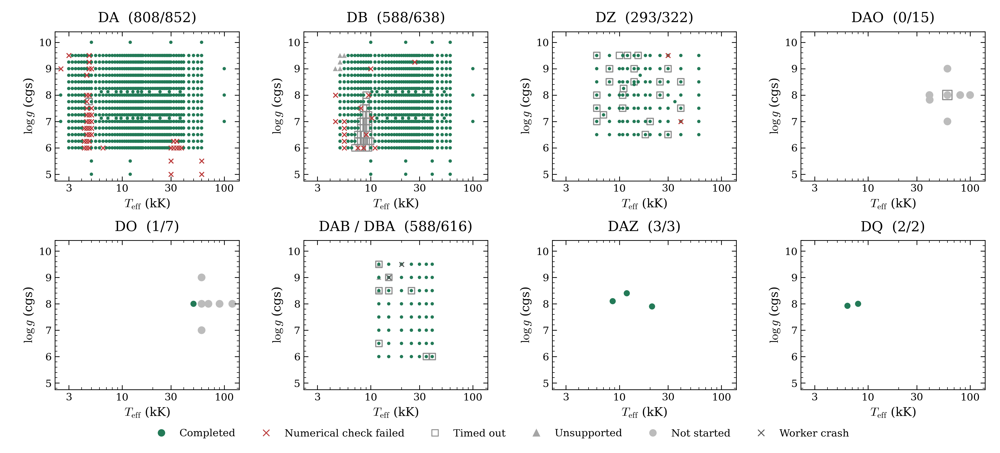

# Precomputed model grids

The selected grid table contains **2,283 numerical completions from 2,459 requests**.
The latest update adds five intermediate DAB abundance planes, giving 588/616
accepted DAB/DBA coordinates at one-dex spacing. Eleven separate DAB validation
coordinates remain outside this mesh. Earlier updates added DB coverage, one DA
repair and a DO pilot; their settings and archives remain unchanged.



Each title gives numerical completions divided by requests. Green circles passed
the recorded checks. Red crosses failed a numerical check or encountered an
invalid numerical depth grid. Grey squares reached a time limit. Grey triangles
could not run their requested configuration. Grey circles were not started. Dark grey crosses mark worker crashes.
Timeouts remain unfinished. Different compositions can share temperature and
gravity, so symbols can overlap. Blank regions were not requested.

| Family | Numerical completions | Requests | Latest selected source |
|---|---:|---:|---|
| DA | 808 | 852 | October 8 + native validation supplement |
| DB | 588 | 638 | October 8 + cold and native validation supplements |
| DZ | 293 | 322 | October 8 |
| DAO | 0 | 15 | One native pilot timed out; 14 not started |
| DO | 1 | 7 | One native pilot passed; six not started |
| DAB/DBA | 588 | 616 | October 9 + October 10 intermediate abundance planes |
| DAZ | 3 | 3 | October 8 |
| DQ | 2 | 2 | October 8 |

The eight-family figure covers 2,455 requests. The full table retains 2,459,
including four D6, DAH and PG1159 cases omitted from the figure. The production
DAB bank replaces the five earlier standard-quality DAB examples in these counts.
Four repeated DB comparison models are counted once at their original coordinates.
All previous selections remain in [dated snapshots](history/2026-10-10-before-abundance-refinement/README.md).

## Downloads and spectrum examples

[Contributor draft releases](https://github.com/cheyanneshariat/OpenWD/releases)
hold the original DA/DB/DZ/DAZ/DQ archives, the 326-spectrum DAB archive, the
four-model cold DB supplement, the 118-spectrum native validation supplement and
the 261-spectrum DAB abundance supplement.
Draft assets require write access to the fork. They are not public downloads until
the releases are published. The original archives remain unchanged.

- [DAB/DBA coverage and spectrum sequences](dab-2026-10-09/README.md) vary
  abundance, temperature and gravity separately. The current selection has
  588/616 accepted points in the [one-dex abundance mesh](dab-1dex-2026-10-10/README.md);
  the original archive contains 326.
- [New grid points and DAB interpolation tests](validation-2026-10-09/README.md)
  give all 136 follow-up requests, their full settings and remaining gaps.
- [Cold DB and Montreal comparison](db-cold-2026-10-09/README.md) preserve the
  earlier four-model demonstration and its unresolved spectral disagreement.

Wavelengths are vacuum Angstroms. Flux is surface Fλ in
`erg s^-1 cm^-2 Angstrom^-1`, without normalization or resampling.
Different families can use different wavelength grids.

## Source versions and remaining limits

The October 8 grids use `cfe2d2ff99a434cd502696c1eb7b2f5daf8d11c5`.
The production DAB grids and their matching interpolation tests use
`0a74fdbe06596fc145f5169a3b239ddd67053141`. The earlier cold DB supplement
preserves its `0a74fdbe` and `54e401e2` records. The new DB, DA and hot pilots
use merged source `c8329d86c98f956617ec1bb3746181350492ce66`.
[Dataset records](dataset.json) and the full request tables identify each source.
Updating OpenWD does not recompute a saved archive.

Accepted models passed the required native atmosphere and spectrum checks.
The new DA point uses the existing `multigrid_initialization=True` option.
The repaired DAB point uses `photospheric_depth_concentration=2`; its earlier
failed default-mesh attempt remains recorded. Native physics, iteration limits
and acceptance tolerances were unchanged.

DB still has 11 nonconvergence cases, five depth-grid errors, five material-domain
stops and 29 timeouts. DAO remains unfinished after a 230-minute pilot. The DAB
abundance mesh now has one-dex spacing. Seven independent tests have qualified
new predictor corners; two meet both exploratory optical interpolation targets.
Temperature/gravity interpolation still needs refinement.
DZ expansion remains paused for matched external validation models.

Numerical completion does not establish physical accuracy, independent atmosphere
depth convergence, interpolation accuracy or calibrated parameter recovery.
Cool dense-helium DB models retain their experimental-physics labels.
The standalone DA mass-domain experiment remains separate from accepted grid models.

## Reproduce the figures

[The selected status table](progress.csv) preserves detailed outcomes alongside
plot categories. Run in the existing NumPy/Matplotlib environment:

```bash
python docs/grids/plot_grid_progress.py --output output/grid-progress
```

The [DAB plotting script](plot_dab_spectra.py) reads the original archive and
optionally uses the current selection table for coverage. The
[validation plotting script](plot_grid_validation.py) reproduces the interpolation
figures and metrics from checksummed saved arrays. The [one-dex mesh script](plot_dab_refinement.py)
reproduces the latest coverage
and abundance sequence. These scripts perform no atmosphere calculation.
