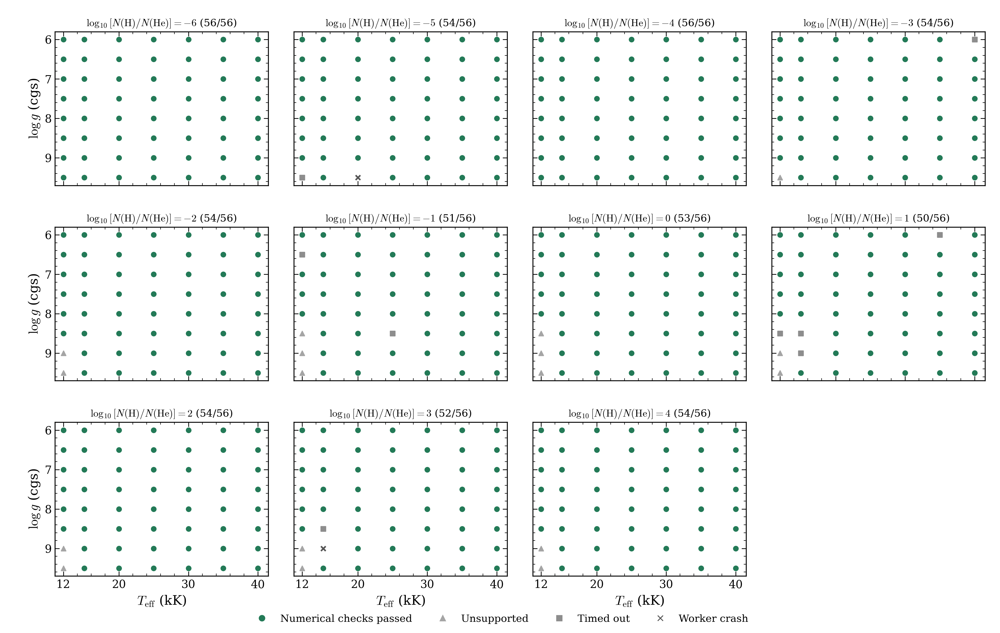
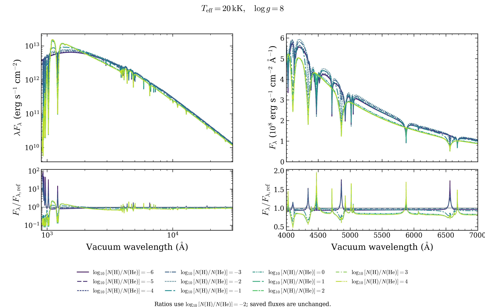
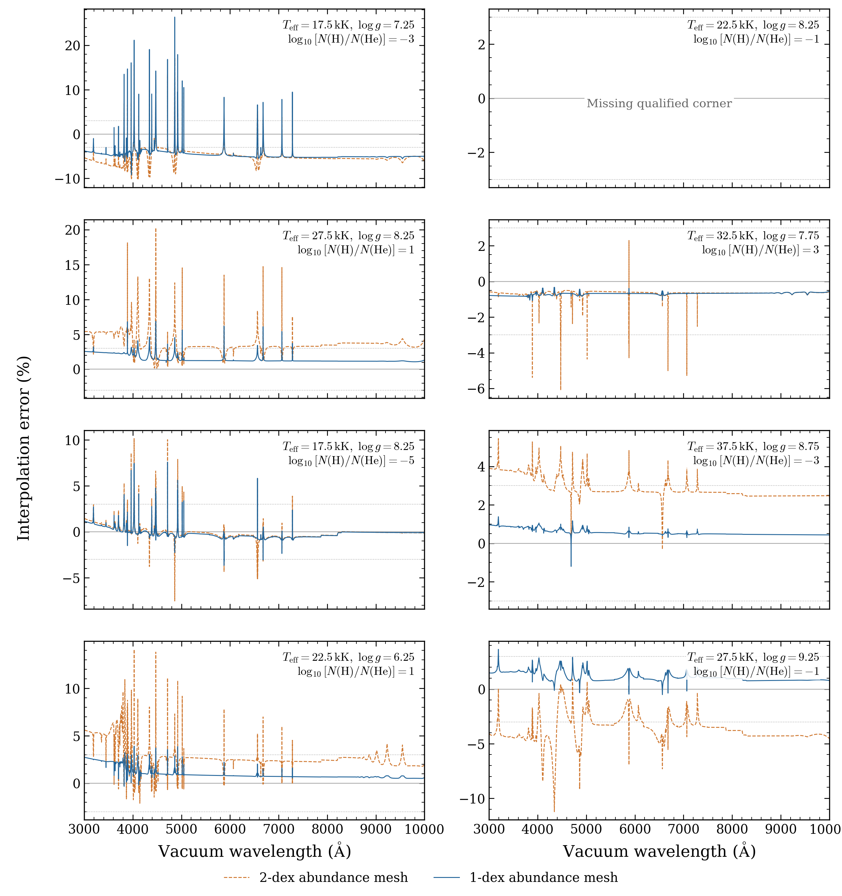

# DAB/DBA grid with one-dex abundance spacing

The selected mesh has **588 numerically accepted models from 616 coordinates**.
All coordinates were attempted. It covers 12,000–40,000 K, log g 6–9.5 and
log10[N(H)/N(He)] = −6 to +4 in steps of one dex. The atmospheres are homogeneous,
metal-free LTE H/He mixtures. The DAB/DBA label names this calculation; it does
not assign an observed spectral class to every composition.

[Selected request table](selected-requests.csv) · [Added-coordinate table](additional-requests.csv)
· [Dataset](dataset.json) · [All families](../README.md)



Each panel holds abundance fixed and gives accepted models divided by its 56
requested coordinates. Green circles passed the required native atmosphere and
independent final-source checks. Grey triangles mark unsupported configurations;
squares mark timeouts; crosses mark worker crashes. Blank regions were not
requested. The 28 remaining gaps are **17 unsupported configurations, nine
timeouts and two worker crashes**. No request remains unattempted or running.

The original six abundance planes retain 327 accepted models from 336 coordinates.
The supplement adds 261 accepted models at 280 intermediate coordinates,
log(H/He) = −5, −3, −1, +1 and +3. Four exact configurations reuse previously
verified calculations; 257 accepted models were calculated in this phase.
Those four points now belong to the grid denominator. Eleven other DAB validation
coordinates remain outside the 616-point mesh.

## Change H/He while temperature and gravity stay fixed



Temperature stays at 20,000 K and log g at 8. Each curve uses its saved native
vacuum wavelengths and absolute surface Fλ. The left panels show 900–30,000 Å;
the right panels show 4,000–7,000 Å. The lower panels divide each spectrum by
the log(H/He) −2 reference at identical samples. No atmosphere spectrum was
normalized, resampled or interpolated to make this sequence.

[Coverage PDF](dab_coverage.pdf) · [Abundance PDF](dab_abundance_sequence.pdf)
· [Exact plotted spectrum hashes](plot_provenance.json)

## Independent interpolation tests



The same eight independently calculated targets test the old and new predictors.
Orange dashed curves use trilinear interpolation in temperature, log g and
log(H/He) across the old two-dex abundance cells. Blue solid curves use the new
exact-abundance plane and bilinear interpolation in temperature and log g.
Both predictions use absolute Fλ at identical native wavelengths. The plotted
error is 100 × (Fλ,predicted/Fλ,direct − 1); dotted lines mark ±3%.

Seven targets have all four qualified new predictor corners. **Two of those seven**
meet both exploratory optical targets: at most 1% integrated absolute error and
3% maximum relative error over 3,000–10,000 Å. Their measured maximum relative
errors span **1.08–26.38%**; integrated absolute errors span **0.513–4.384%**.
The eighth comparison lacks the qualified 25,000 K/log g 8.5/log(H/He) −1 corner,
which timed out. It remains missing; no extrapolation or failed profile fills it.

Several cells improve, but finer abundance spacing does not guarantee a smaller
error at every wavelength. The worst measured peak error rises at the
17,500 K/log g 7.25/log(H/He) −3 target. Temperature/gravity refinement and
additional independent tests are still needed before precision fitting.
These errors compare OpenWD calculations; they do not measure physical accuracy.

[Residual PDF](interpolation_residuals.pdf) · [Corner identities, weights and metrics](interpolation/comparison.json)

## What stopped the remaining calculations?

The 17 unsupported requests selected the native cool molecular workflow outside
its supported gravity. That workflow currently requires log g 8 and production
quality. The calculation stopped without replacing the gravity or substituting
atomic physics. This is a workflow limitation, not evidence that a star cannot
have those parameters.

Nine models reached recorded resource caps without a final certificate. Two
workers exited with **SIGSEGV**, at 15,000 K/log g 9/log(H/He) +3 and
20,000 K/log g 9.5/log(H/He) −5. Their cause remains unresolved. The table keeps
their raw `INFRASTRUCTURE_INTERRUPTION` status and the derived
`WORKER_CRASH_SIGSEGV` category. They are not numerical-convergence failures or
accepted spectra.

The initial 20,000 K/log g 8/log(H/He) −1 pilot reached its one-hour resource cap.
A fresh two-hour retry passed after **90.16 minutes**, allowing its remaining
plane to run. The earlier timeout remains in the raw attempt archive. Native
physics, iteration limits and acceptance tolerances were unchanged.

## Downloads and numerical scope

The contributor draft release is **DAB/DBA abundance refinement — numerical
development preview**, tag `grid-preview-2026-10-10-dab-1dex`.
[Draft assets](https://github.com/cheyanneshariat/OpenWD/releases) require write
access to the fork until publication. The original 326-spectrum archive and
earlier supplements remain unchanged.

`OpenWD-DAB-intermediate-abundances-20261010.tar.gz` contains the 261 accepted
native spectra, their settings, structures and numerical checks, all 280 added
outcomes, diagnostics and file checksums. Its [verified size and SHA-256](package-verification.json)
identify the exact archive. Surface Fλ is in `erg s^-1 cm^-2 Angstrom^-1`, without
normalization or resampling. The saved wavelength grid has 18,901 vacuum samples
from 900 to 30,000 Å.

All calculations use source `0a74fdbe06596fc145f5169a3b239ddd67053141`, matching
the original DAB corners. The archived full configurations preserve native
production settings. The existing coarse 40,000 K/log g 7/log(H/He) −6 repair
retains its explicit mesh-concentration variant; the new planes use the native
default mesh. Updating OpenWD does not recompute these files.

Both CPU allocations ended normally at 00:50 Pacific on October 10. They used
**3.83 allocated node-hours**, including setup and idle allocation time, within
the four-node-hour ceiling. All outputs were retrieved. The second bank's 2,645
remote/local file hashes, 253 saved NPZ files and 2,277 arrays were checked;
the four first-stage successes and four reused configurations were also re-read.
All 1,327 supplement files match their packaged hashes.

Passing native numerical checks does not establish physical accuracy, independent
atmosphere-depth convergence or calibrated parameter recovery. The interpolation
results above define the remaining fitting limitation explicitly.

```bash
tar -xzf OpenWD-DAB-production-20261009.tar.gz
tar -xzf OpenWD-DAB-intermediate-abundances-20261010.tar.gz
(cd OpenWD-DAB-intermediate-abundances-20261010 && shasum -a 256 -c SHA256SUMS)
python docs/grids/plot_dab_refinement.py \
  --coarse-bank OpenWD-DAB-production-20261009 \
  --bank OpenWD-DAB-intermediate-abundances-20261010 \
  --output output/dab-refinement
```

The script verifies saved input and displayed-spectrum hashes and performs no
atmosphere calculation. It exports coverage, the eleven-spectrum abundance
sequence and interpolation residuals as PNG/PDF.
