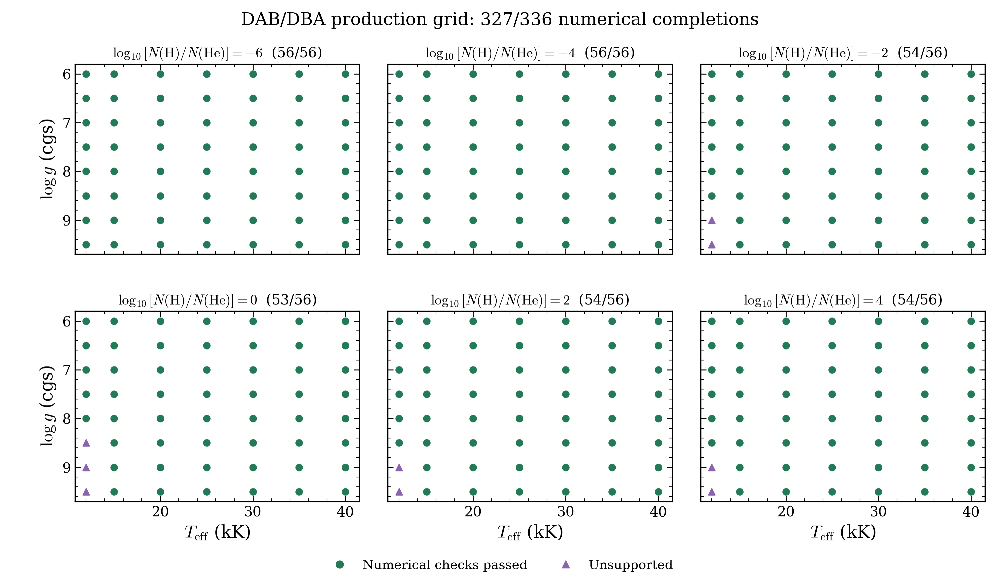
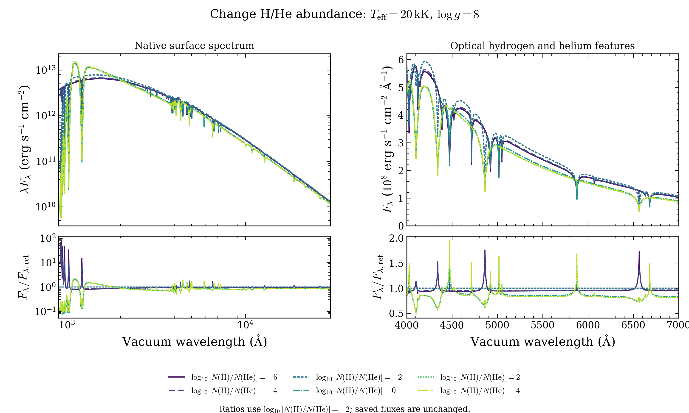
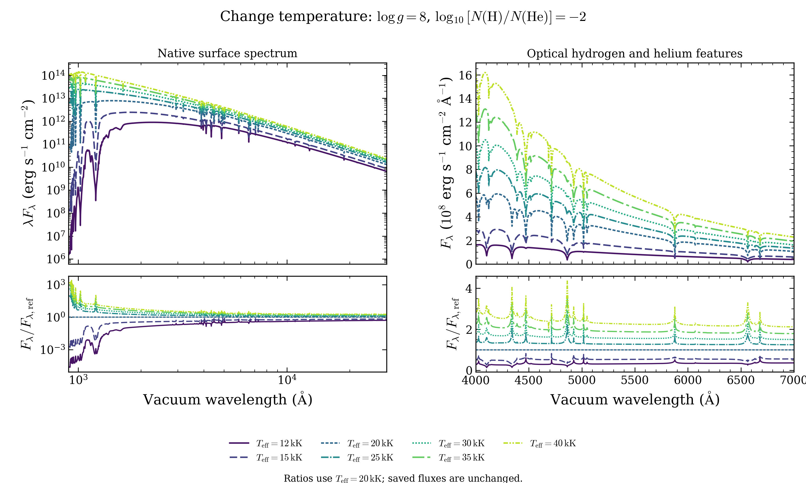
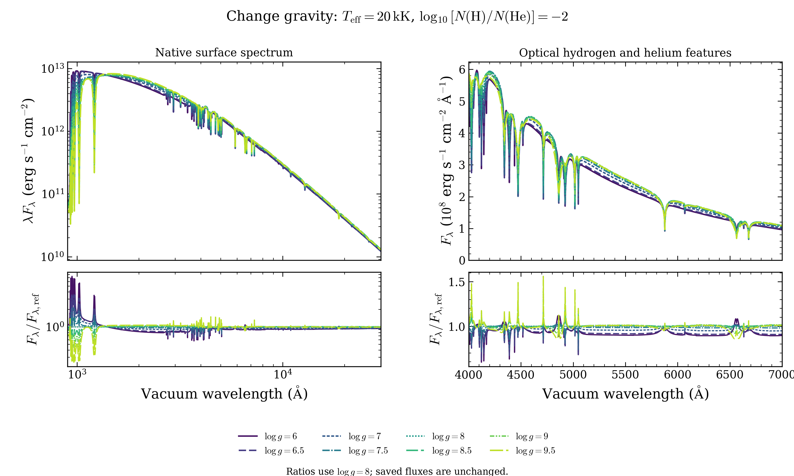

# Original DAB/DBA production grid

The latest [one-dex abundance mesh](../dab-1dex-2026-10-10/README.md) has
588/616 accepted coordinates and an eleven-spectrum abundance sequence.
This page preserves the original six-plane archive and its plots.

The current selection contains **327 accepted points from 336 requested
homogeneous H/He models**. All requests were attempted. Nine requests selected a
molecular workflow that does not support their gravities. The original archive
contains 326 spectra; the native validation supplement supplies the repaired point.

[Download files](https://github.com/cheyanneshariat/OpenWD/releases)
· [Original archive table](requests.csv) · [Current selection](selected-requests.csv)
· [Dataset record](dataset.json)
· [All grid families](../README.md)

The draft release is named **DAB/DBA production grid — numerical development preview**
(`grid-preview-2026-10-09-dab`). Draft assets require write access to the contributor
fork. They are not public downloads until the release is published.

## Coverage

| Parameter | Requested values |
|---|---|
| Effective temperature, K | 12,000; 15,000; 20,000; 25,000; 30,000; 35,000; 40,000 |
| log g, cgs | 6–9.5 in steps of 0.5 |
| log10[N(H)/N(He)] | −6, −4, −2, 0, +2, +4 |



Each panel holds H/He abundance fixed. Its title gives numerical completions
divided by requests. Green circles passed the native atmosphere and independent
final-source checks. The point at 40,000 K, log g 7, log(H/He) −6 now passes
with the existing `photospheric_depth_concentration=2` option. Its original
default-mesh attempt failed temperature stationarity and remains in the old archive.
Purple triangles mark nine molecular selections at 12,000 K away from log g 8.
Those requests stopped without substituting a different gravity or atomic physics.
No request remains unattempted or timed out; four earlier resource retries passed.

The [native validation supplement](../validation-2026-10-09/README.md) also contains
15 independent DAB interpolation and refinement points outside these 336 coordinates.
They are counted separately. All eight coarse-cell interpolation tests exceeded
at least one optical error target. A finer abundance interval reduced the peak
optical error to 0.66% at one temperature/gravity; full fitting accuracy remains unverified.

[Coverage PDF](dab_coverage.pdf). The auxiliary standard-resolution comparison
and DAO resource profile are excluded from the 336-request grid.

## Change one parameter

These sequences use saved, numerically accepted models at their native wavelength
samples. The left panels show 900–30,000 Å; the right panels show 4,000–7,000 Å.
The upper left panels plot wavelength times the absolute surface flux, λFλ.
The upper right panels plot Fλ, with the axis unit scaled by 10^8 for readability.
The lower panels divide each spectrum by the named reference spectrum at identical
samples. These ratios are display diagnostics; no input spectrum is normalized,
smoothed, resampled or interpolated. Colors and line patterns identify each curve.

### Hydrogen-to-helium abundance



Temperature stays at 20,000 K and log g at 8. Only log10[N(H)/N(He)] changes,
from −6 to +4. The ratios use the −2 spectrum as their reference. This sequence
shows how the calculated continuum and hydrogen/helium features change with
composition. It is not an abundance-recovery test.

[Abundance PDF](dab_abundance_sequence.pdf)

### Temperature



Log g stays at 8 and log10[N(H)/N(He)] at −2. Temperature changes from
12,000 to 40,000 K. The ratios use the 20,000 K spectrum. The rising absolute
flux remains visible; it has not been scaled away to match the line shapes.

[Temperature PDF](dab_temperature_sequence.pdf)

### Gravity



Temperature stays at 20,000 K and log10[N(H)/N(He)] at −2. Log g changes
from 6 to 9.5. The ratios use log g 8. The optical panels show line-profile
and continuum differences that overlap in the full-spectrum view.

[Gravity PDF](dab_gravity_sequence.pdf)

## Model settings and limits

The models use source
[`0a74fdbe06596fc145f5169a3b239ddd67053141`](https://github.com/cheyanneshariat/OpenWD/commit/0a74fdbe06596fc145f5169a3b239ddd67053141),
saved on October 9, 2026. Updating OpenWD does not recompute this bank.
Every accepted point selected the atomic `dab` workflow and used a fresh
production start. The atmospheres are homogeneous, metal-free H/He mixtures
in LTE, with ML2/α = 1.25 convection and the native opacity/profile settings.
They do not describe stratified hydrogen layers. The DAB/DBA label names the
mixed-atmosphere calculation; it does not assign an observed spectral class
to every composition and temperature.

Full configuration, source/input hashes, selection records, and per-model
numerical certificates are included in the archive. Accepted models passed
all required measured equilibrium checks and the independent native final-source
check. Both calculations use the recorded structure grid. They do not establish
independent depth convergence, agreement with observations or another atmosphere
code, interpolation accuracy, or calibrated parameter recovery. This matters
particularly at hot or extreme-gravity points. Interpolate only after testing
held-out cold models with the same composition and native settings.

The archive `OpenWD-DAB-production-20261009.tar.gz` is 88,273,096 bytes
(84.2 MiB). Its SHA-256 is:

```text
e6c6c1101dac6295fcff7c434555ff59b57b61a1878e47960625d9b793ac0d2d
```

It contains 326 original two-column spectra, their settings and numerical checks,
the 336-row request table, ten diagnostic records, and file checksums. All spectra
have 18,901 vacuum-wavelength samples from 900 to 30,000 Å. Surface Fλ is in
`erg s^-1 cm^-2 Angstrom^-1`. No failed spectrum is included as an accepted model.

## Reproduce the figures

Download the archive into your OpenWD checkout directory. Extract and verify
it there, then make the figures:

```bash
tar -xzf OpenWD-DAB-production-20261009.tar.gz
(cd OpenWD-DAB-production-20261009 && shasum -a 256 -c SHA256SUMS)
python docs/grids/plot_dab_spectra.py \
  --bank OpenWD-DAB-production-20261009 \
  --coverage-table docs/grids/dab-2026-10-09/selected-requests.csv \
  --output output/dab-grid
```

The script reads the saved table and verifies checksums for every displayed
spectrum. It performs no atmosphere calculations. It exports coverage and
three spectrum sequences as PNG/PDF, plus
[the exact figure inputs](dab_plot_provenance.json). A separate table retains
the original outcomes and full settings for all requests.
