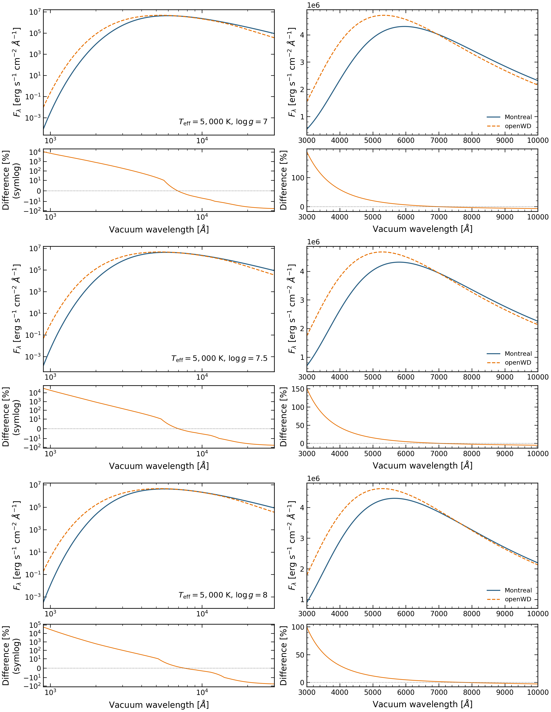

# Cold DB numerical-development supplement

Four native pure-helium production models are available at **5,000 K** and
**log g 7, 7.5, 7.75 and 8**. Each passed the native numerical checks for its
declared experimental dense-helium physics. The supplement adds three parameter
points to the original grid. Log g 8 repeats an accepted comparison model.

[Draft downloads](https://github.com/cheyanneshariat/OpenWD/releases)
· [Model settings](requests.csv) · [Dataset and checks](dataset.json)
· [Current grid overview](../README.md)

The draft release is named **Cold DB supplement — numerical development preview**
(`grid-preview-2026-10-09-db-cold`). Draft files require write access to the
contributor fork. Publishing the release makes them publicly downloadable.

## Which grid records changed?

| Temperature, K | log g | Calculation source | Host | Role |
|---:|---:|---|---|---|
| 5,000 | 7.0 | `0a74fdbe` | Perlmutter | New accepted parameter point |
| 5,000 | 7.5 | `54e401e2` | Mac | New accepted parameter point |
| 5,000 | 7.75 | `54e401e2` | Perlmutter | New accepted parameter point |
| 5,000 | 8.0 | `0a74fdbe` | Perlmutter | Repeated comparison model |

The earlier overview selected these four records at the same parameters as four
original requests. That selection had **492/638 numerical completions**:
492 passed, 109 unsupported, eight numerical failures and 29 timeouts.
The three new points replace previously unsupported records. The log g 8
calculation does not increase the requested or completed denominator.

The later [native validation supplement](../validation-2026-10-09/README.md) adds
96 accepted original coordinates using the merged solver. The current overview
therefore has **588/638** DB completions. This four-model archive and its Montreal
figure remain tied to their original calculations.

The [previous selected snapshot](../history/2026-10-09-dab/README.md),
[original October 8 snapshot](../history/2026-10-08/README.md), and original
489-spectrum archive remain unchanged. Both archives together contain 493 spectra,
because they include two versions of the log g 8 comparison model. Do not count
those versions as separate grid coordinates.

## Comparison with Montreal spectra



The rows hold temperature at 5,000 K and change log g from 7 to 7.5 to 8.
Blue solid curves are Montreal; orange dashed curves are OpenWD. Left panels show
900–30,000 Å with logarithmic axes; right panels show 3,000–10,000 Å with a
linear flux axis. Lower panels give 100 × (OpenWD/Montreal − 1); the broad-band
residual axis uses a symmetric logarithmic scale. Parameter labels identify each
row. No flux scale or continuum normalization was fitted.

The reference is the public `he-grid_v3.tar` 1D LTE helium-rich grid distributed
by P.-E. Tremblay, with Cukanovaite et al. (2021) as its main reference.
Pure helium is encoded as He/H = 10^30; ML2/α = 1.25 matches these OpenWD models.
Its Eddington Hν values were converted to surface Fλ with 4πc/λ². Optical air
wavelengths were converted to vacuum with the recorded legacy convention.
Linear wavelength interpolation puts both saved spectra on a comparison grid;
temperature, gravity and composition were not interpolated.

| log g | Integrated absolute optical difference |
|---:|---:|
| 7.0 | 15.24% |
| 7.5 | 12.56% |
| 8.0 | 9.53% |

The metric is ∫|Fλ,OpenWD − Fλ,Montreal| dλ / ∫Fλ,Montreal dλ over
3,000–10,000 Å. It measures disagreement, not error against ground truth.
The log g 8 spectrum reproduces the original OpenWD comparison model to
floating-point precision, so this discrepancy predates the numerical repairs.

The public spectral grid and the separate Blouin-based `Table_DB` color product
have different dense-helium prescriptions. The closer color-table comparison
does not establish agreement of full spectra. The cause of the blue-flux difference
remains unresolved. See the [public spectral-grid documentation](https://warwick.ac.uk/fac/sci/physics/research/astro/people/tremblay/modelgrids/readmedb.txt)
and [Montréal color-table model description](https://www.astro.umontreal.ca/~bergeron/CoolingModels/).

[Comparison PDF](db_montreal_spectra.pdf) · [Exact plotting provenance](comparison-input.json)

## What is ready, and what still needs work?

These points are ready to share as **numerically qualified experimental models**.
No new HPC run is needed to distribute their verified saved spectra and settings.
The existing atmosphere certificate and independent local-energy, wavelength,
angular and source checks passed. The archive preserves those checks and the
unchanged native samples, with vacuum wavelengths and surface flux in
`erg s^-1 cm^-2 Angstrom^-1`.

They are not a complete low-gravity temperature grid. Independent atmosphere-depth
convergence, physical accuracy and interpolation precision remain unverified.
The merged-solver follow-up now fills many temperature/gravity gaps; its settings
and outcomes are in the native validation supplement. A genuine structure-depth
comparison and physical validation still need work. Adding grid points alone does
not resolve the Montreal discrepancy.

The saved calculations use the source versions listed above and predate the final
merged convective-trial gravity follow-up in PR #20. They have not been relabeled
as runs from current main. Full source hashes and configurations are included in
the download. The saved structure NPZ uses the experimental cold-worker format;
it is not a drop-in ordinary production checkpoint.

## Download and reproduce

`OpenWD-DB-cold-supplement-20261009.tar.gz` contains four spectra, settings,
qualification records, experimental metadata, structures and checksums. The
[dataset record](dataset.json) gives its size and SHA-256.

```bash
tar -xzf OpenWD-DB-cold-supplement-20261009.tar.gz
(cd OpenWD-DB-cold-supplement-20261009 && shasum -a 256 -c SHA256SUMS)
python docs/grids/plot_db_comparison.py --output output/cold-db-comparison
```

The figure script reads the small saved comparison arrays in this directory,
checks their hash and performs no atmosphere calculation. All earlier attempts,
references and spectra remain traceable.
