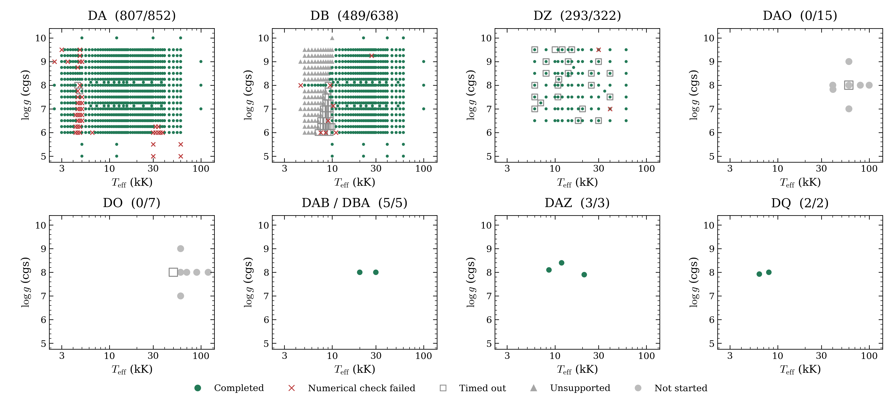

# Initial model grids

We are building precomputed OpenWD grids. This page shows which requested
models passed their numerical checks and which still need work.



Each title gives completed models divided by requested models. The symbols mean:

- Green circles: the model passed the required numerical checks.
- Red crosses: at least one required numerical check failed.
- Grey squares: the run reached its time limit.
- Grey triangles: the workflow used here could not run the requested inputs.
- Grey circles: no calculation was started.

Timeouts remain unfinished. Red crosses include stalled calculations, unstable
temperature profiles and failed bottom-boundary checks. The bottom boundary is
the deepest layer we calculate. That check asks whether this layer is deep
enough to isolate the result from the assumed conditions below it.

Different compositions can share the same temperature and gravity, so their
symbols can overlap. Blank regions were not requested.

| Family | Completed | Requested |
|---|---:|---:|
| DA | 807 | 852 |
| DB | 489 | 638 |
| DZ | 293 | 322 |
| DAO | 0 | 15 |
| DO | 0 | 7 |
| DAB/DBA | 5 | 5 |
| DAZ | 3 | 3 |
| DQ | 2 | 2 |

The figure covers 1,844 requests. The full table retains 1,848 IDs, including
four D6, DAH and PG1159 requests omitted from the figure.

## Downloads

The [draft release](https://github.com/cheyanneshariat/OpenWD/releases)
contains 1,599 spectra, packaged by type: DA, DB, DZ, DAB/DBA, DAZ and DQ.
It also contains full model settings, request tables and file checksums.
The files total about 433 MB. No certified DAO or DO spectra are available yet.
GitHub shows draft files to users with write access to the fork. Publishing
the release will make the downloads public.

Wavelengths are vacuum Angstroms. Flux is surface F_lambda in
`erg s^-1 cm^-2 Angstrom^-1`, without normalization or resampling.
Different workflows can use different wavelength grids.

These models were computed with source
`cfe2d2ff99a434cd502696c1eb7b2f5daf8d11c5` and saved on October 8, 2026.
Newer development runs use a separate source version and are not included here.

Passing numerical checks does not establish physical accuracy. We have not shown that every model stays unchanged when we add atmosphere
layers or extend the calculation deeper.
Cool dense-helium DB models use experimental physics, identified in their records.
This is an incomplete initial grid.

## Reproduce and update the plot

The [status table](progress.csv) keeps each original outcome alongside the
category used in the plot. Use the existing NumPy/Matplotlib environment:

```bash
python docs/grids/history/2026-10-08/plot_grid_progress.py --output output/grid-progress-20261008
```

For an update, export a new verified status table and regenerate the figure.
Record the source version, model settings and saved date. Retain earlier results.
Models stopped by a resource limit or missing required checks remain unfinished.
