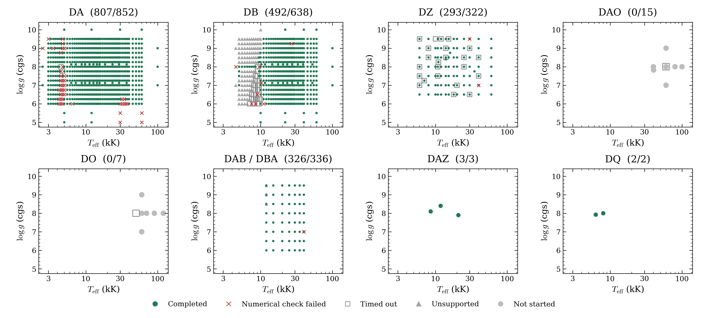

# Precomputed model grids

The current grid table contains **1,923 numerical completions from 2,179 requests**.
The October 9 update adds a 336-point production DAB/DBA grid, with 326 accepted
spectra. A separate cold DB supplement selects four verified 5,000 K models,
adding three accepted parameter points. Other families retain their October 8 results.



Each title gives numerical completions divided by requests. Green circles passed
the recorded checks. Red crosses failed at least one required numerical check.
Grey squares reached a time limit. Grey triangles could not run their requested
configuration. Grey circles were not started. Timeouts remain unfinished.

Different compositions can share temperature and gravity, so symbols can overlap.
The [DAB composition panels](dab-2026-10-09/README.md#coverage) separate that
grid's six abundance planes. Blank regions were not requested.

| Family | Numerical completions | Requests | Source snapshot |
|---|---:|---:|---|
| DA | 807 | 852 | October 8 |
| DB | 492 | 638 | October 8 + cold supplement |
| DZ | 293 | 322 | October 8 |
| DAO | 0 | 15 | October 8 |
| DO | 0 | 7 | October 8 |
| DAB/DBA | 326 | 336 | October 9 |
| DAZ | 3 | 3 | October 8 |
| DQ | 2 | 2 | October 8 |

The eight-family figure covers 2,175 requests. The full table retains 2,179,
including four D6, DAH and PG1159 cases omitted from the figure. Current counts
replace the five earlier standard-quality DAB examples with the new production
grid. Those examples remain in the [October 8 snapshot](../2026-10-08/README.md)
and original archive; they are excluded from the current denominator. The cold
DB supplement replaces four selected records at matching original coordinates;
three add coverage and log g 8 repeats a comparison model. Its prior outcomes
remain in [the preceding snapshot](../2026-10-09-dab/README.md).

## Downloads and spectrum examples

The [contributor's draft releases](https://github.com/cheyanneshariat/OpenWD/releases)
contain the original DA/DB/DZ/DAZ/DQ archives and the new 326-spectrum DAB/DBA
production archive, plus a four-model cold DB supplement. Draft files require
write access to the fork. They become
public only when the releases are published. Numerical development previews are
distinct from a physically qualified release grid.

[DAB/DBA coverage, downloads and spectrum sequences](dab-2026-10-09/README.md)
show abundance, temperature and gravity varied separately. The 84.2-MiB DAB
archive includes all settings, native numerical checks, the ten gaps and checksums.
[Cold DB downloads and Montreal comparison](db-cold-2026-10-09/README.md) identify
all four numerical demonstrations and their experimental-physics scope. The
original grid archives remain unchanged. No qualified hot-family grid was added.

Wavelengths are vacuum Angstroms. Flux is surface Fλ in
`erg s^-1 cm^-2 Angstrom^-1`, without normalization or resampling.
Different families can use different wavelength grids.

## Source versions and qualification

The October 8 grids use source `cfe2d2ff99a434cd502696c1eb7b2f5daf8d11c5`.
The October 9 DAB/DBA grid uses `0a74fdbe06596fc145f5169a3b239ddd67053141`.
The cold DB supplement uses that source for log g 7/8, and
`54e401e20936119d707bb3623e0a13e29373b6e8` for log g 7.5/7.75. Those saved
calculations predate the final merged gravity follow-up; they are not reruns of
current main.
[Dataset records](dataset.json) and each status row identify the actual source.
Updating the repository does not retroactively recompute stored spectra.

Numerical checks include atmosphere equilibrium and the recorded spectrum checks.
A failed check can reflect a stalled solve, temperature instability, source
inconsistency, or an insufficient bottom boundary. The deepest calculated layer
must isolate the spectrum from the assumed conditions below it. The DAB page
records its one temperature-stationarity failure and nine unsupported requests.

Passing these checks does not establish physical accuracy, independent depth
convergence, interpolation precision or calibrated parameter recovery.
Cool dense-helium DB models retain their experimental-physics labels.
The grids are useful for inspecting coverage and model response; several families
and parameter regions still need work.

## Reproduce the coverage figure

[The status table](progress.csv) preserves original outcomes alongside plot
categories. Run in the existing NumPy/Matplotlib environment:

```bash
python docs/grids/plot_grid_progress.py --output output/grid-progress
```

The [DAB plotting script](../../plot_dab_spectra.py) reads the new archive and reproduces
its coverage and spectrum figures. For later updates, retain the earlier snapshot,
record the new source and full settings, and regenerate dependent tables and plots.
