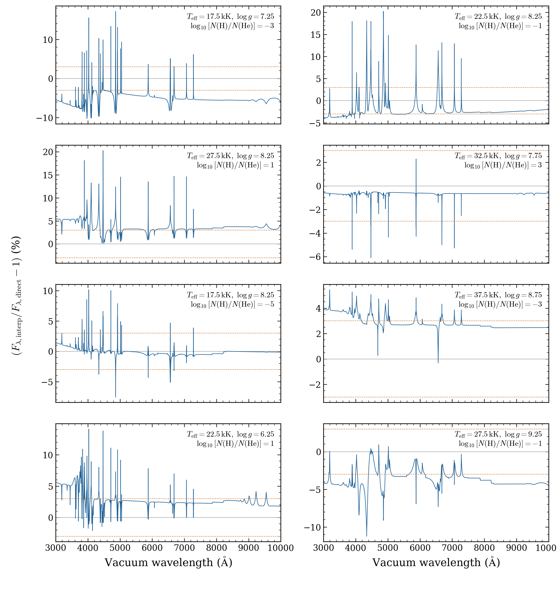
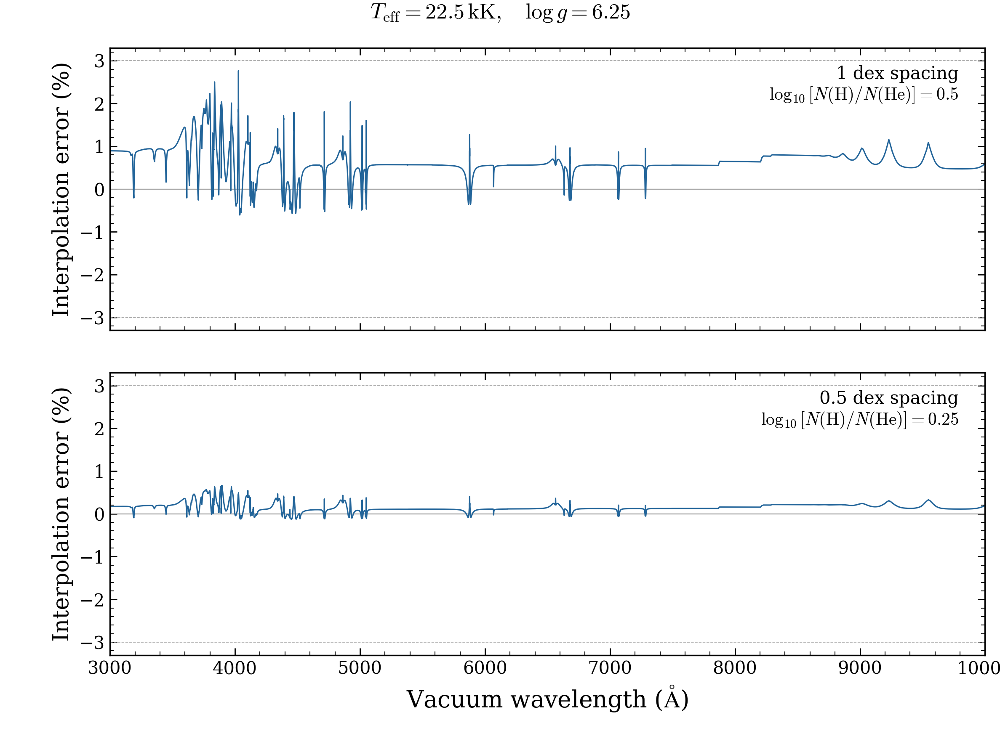

# Native grid validation supplement — October 9

This supplement contains **118 accepted native spectra from 136 model requests**.
It adds 96 accepted DB coordinates to the original grid, repairs one DA and one
DAB coordinate, and supplies a successful DO pilot. The original archives remain
unchanged. Fifteen additional DAB validation points have their own denominator.

[Full settings and outcomes](requests.csv) · [Dataset](dataset.json)
· [Selected grid overview](../README.md)
· [Contributor draft downloads](https://github.com/cheyanneshariat/OpenWD/releases)

| Follow-up family | Numerical completions | Other outcomes |
|---|---:|---|
| DB | 100/113 | 3 nonconvergence; 5 material-domain stops; 5 depth-grid errors |
| DAB/DBA | 16/16 | One original repair and 15 extra validation points |
| DA | 1/5 | 3 nonconvergence; 1 timeout |
| DO | 1/1 | 50,000 K, log g 8 pilot passed |
| DAO | 0/1 | 60,000 K, log g 8, log(H/He) 2 pilot timed out |

Four of the accepted DB pilots repeat previously accepted coordinates. The other
two pilots and 94 gap models add 96 coordinates. The selected original grid now
contains 2,022 numerical completions from 2,179 requests. Its DB, DAB and DA
counts are 588/638, 327/336 and 808/852. The new DO pilot gives 1/7; DAO remains
0/15. [Previous selected records](replaced_records.json) preserve the replaced
outcomes. [Extra DAB points](extra_validation_points.json) are excluded from the
2,179-request denominator.

## Native options that completed two original points

The DA model at 3,500 K/log g 9 passed with the existing
`multigrid_initialization=True` option. It used a fresh production start.
The DAB model at 40,000 K/log g 7/log(H/He) −6 passed with
`photospheric_depth_concentration=2`. Its original default-mesh attempt failed
temperature stationarity. Increasing concentration changes the numerical mesh;
the physical inputs and acceptance tolerances stayed fixed.

The full request table records these explicit variants. Their success does not
show that the unchanged defaults pass at those coordinates. Failed earlier
attempts remain retained. No source physics, reference data, native iteration
limit or acceptance tolerance was changed in this computation phase.

## DAB interpolation needs a finer grid



Each panel compares interpolation with an independently calculated cold-start
model inside a coarse cell. The prediction uses eight matching corners and is
linear in temperature, log g and log10[N(H)/N(He)]. Both spectra use identical
native wavelengths and absolute surface Fλ. The plotted error is
100 × (Fλ,predicted/Fλ,direct − 1). Dashed lines mark the exploratory ±3% target.

All eight direct models passed their numerical checks. Interpolation gave
**5.45–20.26% maximum optical relative error** and **0.608–5.479% integrated
absolute optical error** over 3,000–10,000 Å. None met both targets: 3% maximum
relative error and 1% integrated absolute error. The integrated metric is
∫|Fλ,predicted − Fλ,direct| dλ / ∫Fλ,direct dλ. These targets guide refinement;
they are not calibrated parameter-recovery or physical-accuracy requirements.

[Residual PDF](interpolation/dab_interpolation_residuals.pdf)
· [Direct and interpolated spectra](interpolation/dab_interpolation_spectra.png)
· [Metrics](interpolation/comparison.csv)
· [Corner identities and weights](interpolation/comparison.json)



These two tests hold temperature at 22,500 K and log g at 6.25. The upper panel
predicts log(H/He) 0.5 from endpoints 0 and 1. The lower panel predicts 0.25
from endpoints 0 and 0.5. Each target was calculated independently of its predictor
endpoints. The first target later becomes a predictor for the second test.

| Abundance interval | Independent target | Integrated optical error | Maximum optical error |
|---|---:|---:|---:|
| 1 dex | log(H/He) 0.5 | 0.724% | 2.767% |
| 0.5 dex | log(H/He) 0.25 | 0.167% | 0.662% |

The smaller interval reduces the measured error at this one temperature/gravity.
It does not validate temperature/gravity interpolation or the whole abundance
range. A new abundance plane alone left a three-parameter held-out error of
2.287% integrated and 8.400% maximum. Finer temperature and gravity cells still
need independent tests before this bank supports precision fitting.

[Abundance PDF](abundance/pure_abundance_error.pdf)
· [Inputs and metrics](abundance/comparison.json)

## Remaining model gaps

The five DB material-domain stops raised `DenseHeliumDomainError` because a
native atomic HNC table was sampled outside its allowed domain. No alternate
material table or atomic fallback was substituted. Five other DB errors raised
`optical_depth must increase strictly inward`; those are numerical-grid failures,
not material-domain stops. Their exact causes still need diagnosis.

The request table preserves `raw_status` and the separately derived category.
The ten errors were originally recorded as `ERROR_UNRESOLVED`; inspecting their
exceptions supports the five/five separation above. Nonconvergence means a
required numerical check failed. A timeout means the resource cap stopped an
unfinished solve. None of these categories proves that a physical star with
those parameters cannot exist.

The DO pilot passed after 167.63 minutes. DAO reached its 230.08-minute resource
cap without a final certificate. The DAO timeout does not justify blind scaling
to the remaining hot grid. The selected DA table still has 43 numerical failures
and one timeout; DB has 11 numerical failures, five numerical-grid errors,
five material-domain stops and 29 timeouts. DZ expansion remains paused for
matched external validation models.

## Separate DA domain experiment

Seven DA backend experiments tested the 5,000 K/log g 7.5 boundary failure.
Changing a nominal seed optical depth did not reliably change the final mass
extent. A fresh native gray initialization with 25% more bottom column mass
passed all required backend atmosphere checks and the independent final-source
check. Its bottom escape bound was 2.99 × 10^-5, below the unchanged 0.002 limit.
Doubling the mass extent failed flux, energy and stationarity checks.

The successful backend structure lacks the matching public-request fingerprint.
The public synthesis reader therefore still marks it unconverged. It is excluded
from the 118 accepted spectra and the 2,179-request status table. An explicit
public domain option and correct request provenance need implementation and
validation before this experiment can become a grid model. A passing backend
certificate alone does not establish depth convergence or physical accuracy.

## Download, checks and reproduction

The draft release is **October 9 native grid validation supplement**,
tag `grid-validation-2026-10-09`. Draft assets require write access to the
contributor fork. Publication and PR merge remain separate steps.

`OpenWD-grid-validation-20261009.tar.gz` is 15,912,007 bytes. SHA-256:

```text
4d6b73b64503963211e6ad0a1dc659cc93288d5434799fb55dd7d70db2e947cb
```

The archive retains native spectra, saved structures, full configurations,
numerical checks, source identities, all 136 outcomes and file checksums.
Wavelength is vacuum Angstrom; surface Fλ is in
`erg s^-1 cm^-2 Angstrom^-1`. No accepted spectrum was normalized or resampled.
All 611 packaged files were re-read and verified. Before packaging, 519 saved NPZ
files and 3,872 arrays were read without pickle. Accepted spectra were checked
for finite flux, increasing wavelength and nonnegative flux. Complete raw attempts,
including the seven separate backend experiments, remain in the validation archive.

DB, DA and hot models use merged source `c8329d86c98f956617ec1bb3746181350492ce66`.
DAB uses `0a74fdbe06596fc145f5169a3b239ddd67053141` to match the original corners.
All accepted models passed their required native atmosphere and final-spectrum
checks on the recorded structure grid. These checks do not establish independent
atmosphere-depth convergence or physical accuracy. Cool dense-helium physics
remains experimental; the Montreal spectral discrepancy is unresolved.

```bash
tar -xzf OpenWD-grid-validation-20261009.tar.gz
(cd OpenWD-grid-validation-20261009 && shasum -a 256 -c SHA256SUMS)
python docs/grids/plot_grid_validation.py --output output/grid-validation
```

The plotting script checks saved input hashes, recomputes the interpolation metrics
and exports PNG/PDF figures. It performs no atmosphere calculations. The original
full configurations and source/spectrum hashes accompany each comparison.
